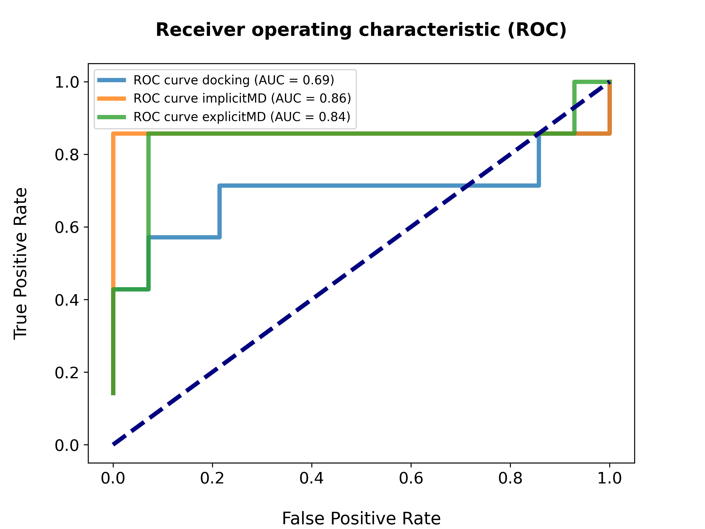
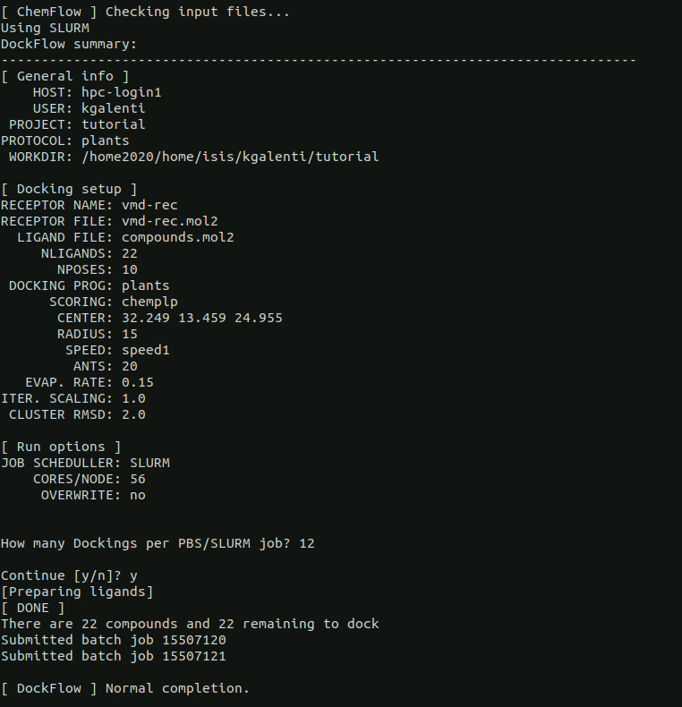

========
Tutorial
========

Chem\ *Flow* - alpha-Thrombin
+++++++++++++++++++++++++++++

Copy the file "ChemFlow_tutorial_a-thrombin.tar.gz" present in ChemFlow/tutorial/ to place you want to run the tutorial.

Now extract with

``tar xvfz ChemFlow_tutorial_a-thrombin.tar.gz``

Now go to the folder and start playing :)

cd ChemFlow_tutorial_a-thrombin/

Provided files
**************

+-----------------------+------------------------------------------------+
| 1DWD.pdb              | Original PDB                                   |
+-----------------------+------------------------------------------------+
| vmd-rec.pdb           | Receptor prepared with pdb4amber and --reduce. |
+-----------------------+------------------------------------------------+
| vmd-rec.mol2          | Receptor saevd using VMD.                      |
+-----------------------+------------------------------------------------+
| reference_ligand.pdb  | Ligand from 1DWC crystal structure.            |
+-----------------------+------------------------------------------------+
| reference_ligand.mol2 | converted with openbabel.                      |
+-----------------------+------------------------------------------------+
| ligands.smi           | b1-b7 ligands.                                 |
+-----------------------+------------------------------------------------+
| actives.sdf           | 1D3D 1D3P 1D3Q 1D3T 1DWB 1DWC 1DWD             |
+-----------------------+------------------------------------------------+
| decoys.sdf            | decoys for a-thrombin, from DUD-E              |
+-----------------------+------------------------------------------------+
| compounds.mol2        | actives and inactive, input for tutorial       |
+-----------------------+------------------------------------------------+

Dock\ *Flow*
************

Step 1: Set the center coordinates for the binding pocket
---------------------------------------------------------
ChemFlow ships a tool to compute optimal box origin and dimensions provided a known ligand. Use the reference ligand to compute the center for docking. You may skip this step if you want to provide the coordinates manually.

Use the reference ligand to compute the center for docking.

Running the script *bounding_shape.py* you will get the sphere/box dimensions.
Since AutodockVina requires a search space in each dimension that is no less than 15 larger than the size of the ligand, and no less than 22 Å total, we will compute the dimensions of the box with a padding of 15 Å, specified with the flag "-p". This definition of the box will then be adapted also for Qvina and Smina in the following steps.

For PLANTS you will get the center and the radius of the sphere. By default the radius of the sphere is 15 Å.

.. code-block:: bash

    python $(which bounding_shape.py) reference_ligand.mol2 --shape sphere

For VINA you need the center of the box AND the lenghts of X Y and Z.

.. code-block:: bash

    python $(which bounding_shape.py) reference_ligand.mol2 --shape box -p 15

You should obtain:  

``PLANTS: 32.249 13.459 24.955 15.000``
    
``VINA: 32.249 13.459 24.955 18.886 22.290 19.700``

Step 2: Run Dock\ *Flow* to predict the docking poses.
------------------------------------------------------

To demonstrate **DockFlow** we'll run it with **three** sets of ligands, some of which we only know the binding
affinity (7 compounds), second we know both the affinity and crystal structure (7 compounds)_ and third a set of decoys (14 compounds) All these scenarios will be used in the report different features. In the first place, we'll confront the 14 actives with the 14 decoys and evalute the classification (active/inactive) done by the scoring function from each docking program. Then using the crystal structures we'll evaluate the accuracy of each docking program to produce docking poses near the native one (**docking power**), finally.

Then we'll evaluate the quality of the scoring functions to rank the docking poses (**ranking power**) which will be latter compared with **ScoreFlow**
results together with the **scoring power** which will measure how well it will rank *compounds* against each other.

Let's do it locally:
Run DockFlow for each set of ligands.

* First, activate the conda environment of ChemFlow

.. code-block:: bash

    conda activate ChemFlow

* Using plants: ( -sf chemplp,plp,plp95 - chemplp is the default)

.. code-block:: bash

    DockFlow -p tutorial --protocol plants -r vmd-rec.mol2 -l compounds.mol2 --center 32.249 13.459 24.955 --radius 15

* Using vina: ( -sf vina )

.. code-block:: bash

    DockFlow -p tutorial --protocol vina -r vmd-rec.mol2 -l compounds.mol2 --center 32.249 13.459 24.955 --size 18.886 22.290 19.700 -sf vina -dp vina

* Using qvina: ( -sf vina )

.. code-block:: bash

    DockFlow -p tutorial --protocol qvina -r vmd-rec.mol2 -l compounds.mol2 --center 32.249 13.459 24.955 --size 18.886 22.290 19.700 -sf vina -dp qvina

* Using smina with the scoring function vinardo: (-sf vina,vinardo,dkoes_fast,dkoes_scoring)

.. code-block:: bash

    DockFlow -p tutorial --protocol smina-vinardo  -r vmd-rec.mol2 -l compounds.mol2 --center 32.249 13.459 24.955 --size 18.886 22.290 19.700 -sf vinardo -dp smina
    
* Using smina with the scoring function vina: (-sf vina,vinardo,dkoes_fast,dkoes_scoring)

.. code-block:: bash

    DockFlow -p tutorial --protocol smina-vina  -r vmd-rec.mol2 -l compounds.mol2 --center 32.249 13.459 24.955 --size 18.886 22.290 19.700 -sf vina -dp smina

* For smina you can also run the Docking with a configuration file, in which you specify the center and the size of the box and a different scoring function to use:

.. code-block:: bash
    DockFlow -p tutorial --protocol config -r vmd-rec.mol2 -l compounds.mol2 --config_smina config.txt -dp smina

Some examples of the configuration files that one can use are provided in the folder: 
ChemFlow/ChemFlow/templates/smina/

Modify the center and size of the box as well as the scoring function you want to use and other feautes you want to apply to run the docking with Smina. 

For each of these commands you will be asked:

* Continue? > y

Here an example of a summary that will appear on your screen, after launching the Dock\ *Flow* command:

.. image:: images/summary-DockFlow-21.png
   :width: 800

Step 3: Postprocess all the results
-----------------------------------

Docking generates several files for each complex and the big issue here is that each docking program organizes their results their own way.
To organize and standardize all results to the ChemFlow standands you should <b>--postprocess</b>.  
Here, we decided to keep only the best 3 poses for each ligand, as specified by the flag *-n* that stands for number of poses (-n 3).

Each energy and structure will be extracted from it's folder and written into a single Structure file (docked_ligands.mol2) and a single Energy file (DockFlow.csv) containing the selected structures. 

.. code-block:: bash

    DockFlow -p tutorial --protocol plants -r vmd-rec.mol2 -l compounds.mol2 --postprocess --overwrite -n 3 

.. code-block:: bash

    DockFlow -p tutorial --protocol vina   -r vmd-rec.mol2 -l compounds.mol2 --postprocess -sf vina -dp vina --overwrite -n 3 

.. code-block:: bash

    DockFlow -p tutorial --protocol qvina  -r vmd-rec.mol2 -l compounds.mol2 -sf vina -dp qvina --postprocess --overwrite -n 3
    
.. code-block:: bash

    DockFlow -p tutorial --protocol smina-vina  -r vmd-rec.mol2 -l compounds.mol2 -sf vina -dp smina --postprocess  --overwrite -n 3

.. code-block:: bash

    DockFlow -p tutorial --protocol smina-vinardo  -r vmd-rec.mol2 -l compounds.mol2 -sf vinardo -dp smina --postprocess  --overwrite -n 3

At the end of the postprocessing Dock\ *Flow* writes DockFlow.csv with the docking score of the poses that you have kept for each ligand:

.. image:: images/DockFlow-csv-21.png
   :width: 600 

In this csv file are reported: the docking program that has been used, the protocol, the receptor and ligand names, the pose number and as last column the docking score.

Now we can analyze the results of the docking, by plotting the ROC curve and the AUC for each docking program we used.
The decoys are the last 14 molecules in the file *compounds.mol2* (from C04221783 to C12716025).

We computed the **AUC** with python, by using hte jupyter notebook that is in the tutorial folder, named *ROC-CURVE-DOCKFLOW.ipynb*.
Please run the notebook in the **example** folder, in order to properly load the input files, following the designed path.

We got the following results:

   

The various AUC show us that the best scoring function for our dataset seems to be chemPLP, but since docking is an approximative way of computing binding affinity, we suggest to rescore the compounds docked by PLANTS with an end-point free energy re-scoring method known as MMGB/(PB)SA.

To do so, we invite you in continuing the tutorial until the module named Score\ *Flow* in which we implemented the MMGB/(PB)SA free energy re-scoring method.

Step 3.1: Archiving the results
-------------------------------

You can choose to archive the docking folder and get a nicely organized folder with your **docked_ligands.mol2**

   

Lig\ *Flow*
***********

Step 4: Compute AM1-BCC and RESP charges for the docked ligands
---------------------------------------------------------------

Lig\ *Flow* takes multimol2 files as input, then organizes them individually into your project folder to then compute *bcc* or *resp* charges.
By default Lig\ *Flow* compute AM1-BCC charges.

Here we compute bcc charges for the first 3 poses of the docked compounds:

.. code-block:: bash

    LigFlow -p tutorial -l tutorial_chemflow/DockFlow/plants/vmd-rec/docked_ligands.mol2 
    
The command can be run locally, even if it is computationally expensive.

Also in this case you will get a summary of the variables you chose for running the program as follows:

   

Score\ *Flow*
************

Step 5: Run Score\ *Flow* to rescore the previous docking poses (best 3 for each ligand)
----------------------------------------------------------------------------------------
Here, we only keep on with plants results (tutorial_chemflow/DockFlow/plants/vmd-rec/docked_ligands.mol2).

Rescoring through the MMGBSA method, using two protocols in **implicit solvent** first just minimization, then 1ns MD simulation :

.. code-block:: bash

    ScoreFlow -p tutorial --protocol mmgbsa -r vmd-rec.pdb -l tutorial_chemflow/DockFlow/plants/vmd-rec/docked_ligands.mol2 --bcc -sf mmgbsa
    
.. code-block:: bash
    
    ScoreFlow -p tutorial --protocol mmgbsa_md -r vmd-rec.pdb -l tutorial_chemflow/DockFlow/plants/vmd-rec/docked_ligands.mol2 --bcc -sf mmgbsa --md

Please note that we specified to use for the rescoring the mol2 of the docked ligands for which we computed AM1-BCC charges, by adding the flag "*--bcc*"

Now we can rescore the same compounds with MMGBSA in **explicit solvent**, running 1ns MD simulation :

.. code-block:: bash

    
    ScoreFlow -p tutorial -r vmd-rec.pdb -l tutorial_chemflow/DockFlow/plants/vmd-rec/docked_ligands.mol2 --bcc --water -sf mmgbsa --md --protocol explicit_mmgbsa 

Also here we specified to use for the rescoring the mol2 of the docked ligands for which we computed AM1-BCC charges, by adding the flag "*--bcc*".
We indicate that we want to run **explicit** solvent MMGBSA calculations by adding the flag *--water* .

Running an MD simulation of 1ns would take around 10 minutes per compound on your local computer.

At the end of the free-energy rescoring you will have one file *mmgbsa.dat* per compound in the ligand folder. 
These data are postprocessed and collected in *ScoreFlow.csv* file in the receptor directory with the following commands for implicit

.. code-block:: bash

    ScoreFlow -p tutorial --protocol mmgbsa_md -r vmd-rec.pdb -l tutorial_chemflow/DockFlow/plants/vmd-rec/docked_ligands.mol2 --bcc -sf mmgbsa --postprocess

and explicit MD

.. code-block:: bash

    ScoreFlow -p tutorial -r vmd-rec.pdb -l tutorial_chemflow/DockFlow/plants/vmd-rec/docked_ligands.mol2 --bcc --water -sf mmgbsa --md --protocol explicit_mmgbsa  --postprocess

From *SORTED-uniq-lig.csv* we can extract the data and compute again a ROC curve in order to see if with MMGBSA single point and MMGBSA re-scoring in explicit solvent we were able to  improve our predictive power, increasing the AUC value.

Here we plot the ROC curve with the results of the docking performed with chemPLP scoring function and the results of MMGBSA computed in implicit solvent (single point analysis) and in explicit solvent after 1ns md:

It emerges that the AUC of ChemPLP scoring function is the highest and that MMGBSA in explicit solvent is better than the calculations run with implicit solvent.

The fact that MMGBSA in explicit solvent has an AUC lower than the one of the docking protocol is probably due to the fact that we run just 1ns MD and the system would need longer simulations.

The calculations are always system dependent, so we suggest you to try different protocols playing around with the input files of both MD and MMGB/PBSA.

You can do this by running Score\ *Flow* with the flag *--write-only*. This will write the default input files in the receptor directory and you can modify them according to your needs and experiments. 

Here an example for the explicit solvent calculations:

.. code-block:: bash
    
    ScoreFlow -p tutorial -r vmd-rec.pdb -l tutorial_chemflow/DockFlow/plants/vmd-rec/docked_ligands.mol2 --bcc --water -sf mmgbsa --md --protocol explicit_mmgbsa --write-only

Once modifyed the iunput files, you can run them re-launching the command line of Score\ *Flow*, but this time with the flag *--run-only*.

.. code-block:: bash
    
    ScoreFlow -p tutorial -r vmd-rec.pdb -l tutorial_chemflow/DockFlow/plants/vmd-rec/docked_ligands.mol2 --bcc --water -sf mmgbsa --md --protocol explicit_mmgbsa --run-only
    

Run Chem\ *Flow* on HPC
***********************

Chem\ *Flow* gives you the opportunity to also run the workflow on a cluster/supercomputer.
If you are logged to a cluster/supercomputer, you may profit from the HPC resources using --slurm or --pbs flags accordingly.
ChemFlow will automatically distribute the jobs for you after you answer some questions. 
To run it properly, you should provide a template for your scheduler using the \\-\\-header FILE option. Here are examples for this header file for Score\ *Flow*.

In order to retrieve the path of the ChemFlow environment, you can type on the terminal:

.. code-block:: bash

    conda info --envs
    
 
and it will appear 

**ChemFlow                                  your/path/env/ChemFlow**
    
 
Once you have it, you can add the line in the header file to source *amber.sh* of the environment.

* Example for pbs::

    #! /bin/bash
    # 1 noeud 8 coeurs
    #PBS -q  route
    #PBS -N
    #PBS -l nodes=1:ppn=1
    #PBS -l walltime=0:30:00
    #PBS -V

    source your/path/env/ChemFlow/amber.sh

* Example for slurm::

    #! /bin/bash
    #SBATCH -p publicgpu
    #SBATCH -n 1
    #SBATCH -t 2:00:00
    #SBATCH --gres=gpu:1
    #SBATCH --job-name="CF"
    #SBATCH -o slurm.out
    #SBATCH -e slurm.err

    #
    # Configuration
    #
    # Make sure you load all the necessary modules for your AMBER installation.
    # Don't forget the CUDA modules
    module load slurm/slurm
    module load intel/intel20
    module load intel/oneAPI-2021
    module load openmpi/openmpi-4.0.i21
    
    # Path to amber.sh replace with your own
    source your/path/env/ChemFlow/amber.sh
    
    #Or if it exists a precompiled version of amber on the cluster then you can directly load the module"
    module load amber/amber18
    
Also for Dock\ *Flow* and Lig\ *Flow* you need to provide an header file to run on HPC resources.
For running Lig\ *Flow* you need to load the gaussian module g09 and for Dock\ *Flow* you will need to answer how many compounds should be treated per job.

Dock\ *Flow*:
-------------
Connect to your slurm cluster.

* Using plants with slurm:

.. code-block:: bash

    DockFlow -p tutorial --protocol plants -r vmd-rec.mol2 -l compounds.mol2 --center 32.249 13.459 24.955 --radius 15 --slurm --header DockFlow.header

or pbs:

.. code-block:: bash
    
    DockFlow -p tutorial --protocol plants -r vmd-rec.mol2 -l compounds.mol2 --center 32.249 13.459 24.955 --radius 15 --pbs --header DockFlow.header

* Using vina with slurm:

.. code-block:: bash

    DockFlow -p tutorial --protocol vina -r vmd-rec.mol2 -l compounds.mol2 --center 32.249 13.459 24.955 --size 18.886 22.290 19.700 -sf vina --slurm --header DockFlow.header
    

or pbs:
.. code-block:: bash

    DockFlow -p tutorial --protocol vina -r vmd-rec.mol2 -l compounds.mol2 --center 32.249 13.459 24.955 --size 18.886 22.290 19.700 -sf vina --pbs --header DockFlow.header

**If all goes right, you should see a summary like this one:**

Lig\ *Flow*:
------------

Computing AM1-BCC and RESP charges is computationally expensive and having the possibility to run the calculation on HPC becomes very useful.
To run Lig\ *Flow* on HPC you can use the same command line you have used locally, adding the header file and specifying *--slurm* or *--pbs*.
**Remember** to load the module of Gaussian g09 to calculate charges.

Score\ *Flow*:
--------------

.. code-block:: bash

    ScoreFlow -p tutorial --protocol mmgbsa    -r vmd-rec.pdb -l tutorial_chemflow/DockFlow/plants/vmd-rec/docked_ligands.mol2 --pbs -sf mmgbsa
    
.. code-block:: bash

    ScoreFlow -p tutorial --protocol mmgbsa_md -r vmd-rec.pdb -l tutorial_chemflow/DockFlow/plants/vmd-rec/docked_ligands.mol2 --pbs -sf mmgbsa --md

For each of these commands you will be asked:

* Continue? > y

