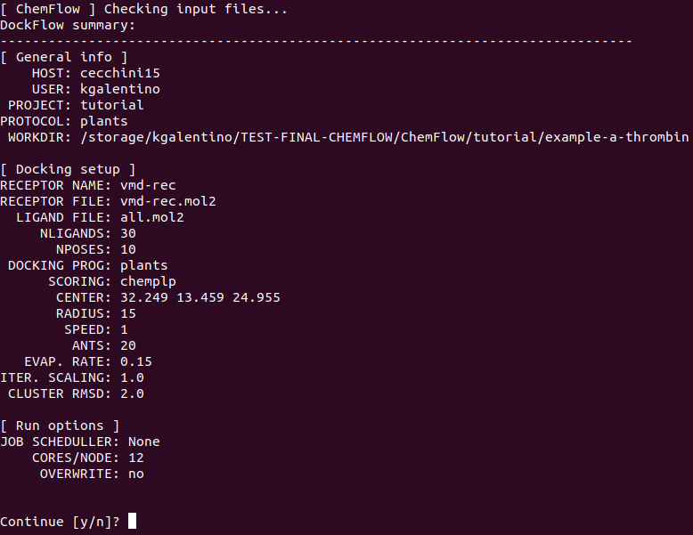
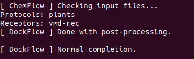
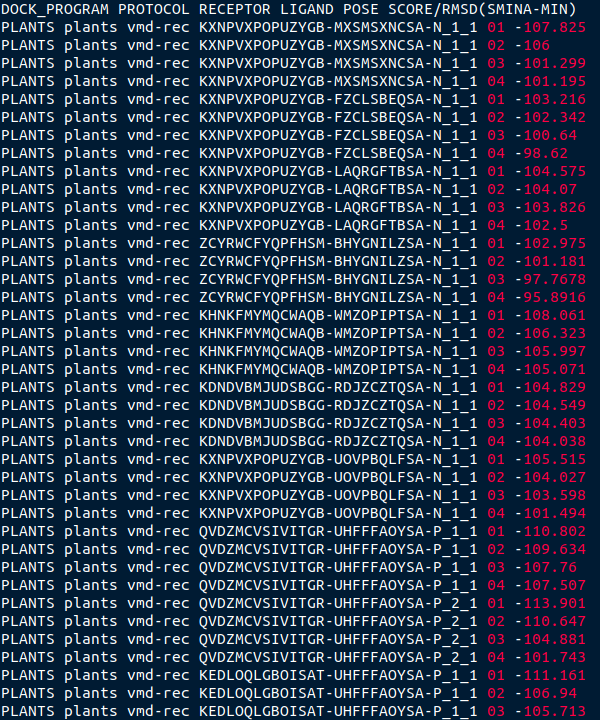
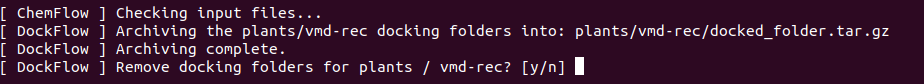
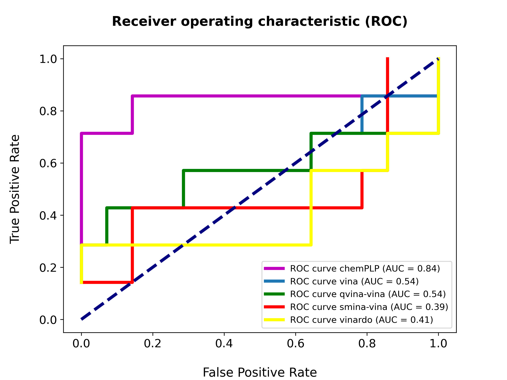
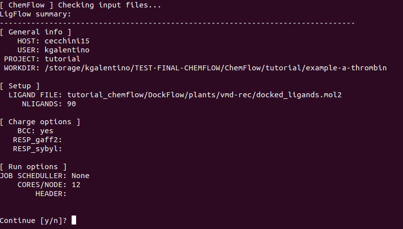

========
Tutorial
========

Chem\ *Flow* - alpha-Thrombin
+++++++++++++++++++++++++++++

Copy the file "ChemFlow_tutorial_a-thrombin.tar.gz" present in ChemFlow/tutorial/ to place you want to run the tutorial.

Now extract with

``tar xvfz ChemFlow_tutorial_a-thrombin.tar.gz``

Now go to the folder and start playing :)

cd ChemFlow_tutorial_a-thrombin/

Provided files
**************

+-----------------------+------------------------------------------------+
| 1DWD.pdb              | Original PDB                                   |
+-----------------------+------------------------------------------------+
| receptor.pdb          | Receptor prepared with pdb4amber and --reduce. |
+-----------------------+------------------------------------------------+
| receptor.mol2         | Receptor prepared using SPORES.                |
+-----------------------+------------------------------------------------+
| vmd-rec.mol2         | Receptor prepared using SPORES.                |
+-----------------------+------------------------------------------------+
| reference_ligand.pdb  | Ligand from 1DWC crystal structure.            |
+-----------------------+------------------------------------------------+
| reference_ligand.mol2 | converted with openbabel.                      |
+-----------------------+------------------------------------------------+
| ligands.smi           | b1-b7 ligands.                                 |
+-----------------------+------------------------------------------------+
| ligands_crystal.smi   | 1D3D 1D3P 1D3Q 1D3T 1DWB 1DWC 1DWD             |
+-----------------------+------------------------------------------------+
| decoys.smi            | decoys for a-thrombin, from DUD-E              |
+-----------------------+------------------------------------------------+

Dock\ *Flow*
************

Step 1: Set the center coordinates for the binding pocket
---------------------------------------------------------
ChemFlow ships a tool to compute optimal box origin and dimensions provided a known ligand. Use the reference ligand to compute the center for docking. You may skip this step if you want to provide the coordinates manually.

Use the reference ligand to compute the center for docking.

Running the script *bounding_shape.py* you will get the sphere/box dimensions.
Since AutodockVina requires a search space in each dimension that is no less than 15 larger than the size of the ligand, and no less than 22 Å total, we will compute the dimensions of the box with a padding of 15 Å, specified with the flag "-p".

For PLANTS you will get the center and the radius of the sphere

.. code-block:: bash

    python $(which bounding_shape.py) reference_ligand.mol2 --shape sphere

For VINA you need the center of the box AND the lenghts of X Y and Z.

.. code-block:: bash

    python $(which bounding_shape.py) reference_ligand.mol2 --shape box -p 15

You should obtain:  

``PLANTS: 32.249 13.459 24.955 15.000``
    
``VINA: 32.249 13.459 24.955 18.886 22.290 19.700``

Step 2: Run Dock\ *Flow* to predict the docking poses.
------------------------------------------------------

To demonstrate **DockFlow** we'll run it with **three** sets of ligands, some of which we only know the binding
affinity (7 compounds), second we know both the affinity and crystal structure (7 compounds)_ and third a set of decoys (14 compounds) All these scenarios will be used in the report different features. In the first place, we'll confront the 14 actives with the 14 decoys and evalute the classification (active/inactive) done by the scoring function from each docking program. Then using the crystal structures we'll evaluate the accuracy of each docking program to produce docking poses near the native one (**docking power**), finally.

Then we'll evaluate the quality of the scoring functions to rank the docking poses (**ranking power**) which will be latter compared with **ScoreFlow**
results together with the **scoring power** which will measure how well it will rank *compounds* against each other.

Let's do it locally:
Run DockFlow for each set of ligands.

* First, activate the conda environment of ChemFlow

.. code-block:: bash

    conda activate ChemFlow

* Using plants: ( -sf chemplp,plp,plp95 - chemplp is the default)

.. code-block:: bash

    DockFlow -p tutorial --protocol plants -r vmd-rec.mol2 -l all.mol2 --center 32.249 13.459 24.955 --radius 15

* Using vina: ( -sf vina )

.. code-block:: bash

    DockFlow -p tutorial --protocol vina   -r vmd-rec.mol2 -l all.mol2 --center 32.249 13.459 24.955 --size 18.886 22.290 19.700 -sf vina -dp vina

* Using qvina: ( -sf vina )

.. code-block:: bash

    DockFlow -p tutorial --protocol qvina   -r vmd-rec.mol2 -l all.mol2 --center 32.249 13.459 24.955 --size 18.886 22.290 19.700 -sf vina -dp qvina

* Using smina with the scoring function vinardo: (-sf vina,vinardo,dkoes_fast,dkoes_scoring)

.. code-block:: bash

    DockFlow -p tutorial --protocol smina-vinardo  -r vmd-rec.mol2 -l all.mol2 --center 32.249 13.459 24.955 --size 18.886 22.290 19.700 -sf vinardo -dp smina
    
* Using smina with the scoring function vina: (-sf vina,vinardo,dkoes_fast,dkoes_scoring)

.. code-block:: bash

    DockFlow -p tutorial --protocol smina-vinardo  -r vmd-rec.mol2 -l all.mol2 --center 32.249 13.459 24.955 --size 18.886 22.290 19.700 -sf vina -dp smina

* For smina you can also run the Docking with a configuration file, in which you specify the center and the size of the box and a different scoring function to use:

.. code-block:: bash
    DockFlow -p tutorial --protocol config -r vmd-rec.mol2 -l all.mol2 --config_smina config.txt -dp smina

Some examples of the configuration files that one can use are provided in the folder: 
ChemFlow/ChemFlow/templates/smina/

Modify the center and size of the box as well as the scoring function you want to use and other feautes you want to apply to run the docking with Smina. 

For each of these commands you will be asked:

* Continue? > y

Here an example of a summary that will appear on your screen, after launching the Dock\ *Flow* command:

Step 3: Postprocess all the results
-----------------------------------

Docking generates several files for each complex and the big issue here is that each docking program organizes their results their own way.
To organize and standardize all results to the ChemFlow standands you should <b>--postprocess</b>.  
Here, we decided to keep only the best 3 poses for each ligand, as specified by the flag *-n* that stands for number of poses (-n 3).

Each energy and structure will be extracted from it's folder and written into a single Structure file (docked_ligands.mol2) and a single Energy file (DockFlow.csv) containing the selected structures. 

.. code-block:: bash

    DockFlow -p tutorial --protocol plants -r vmd-rec.mol2 -l all.mol2 --postprocess --overwrite -n 3 

.. code-block:: bash

    DockFlow -p tutorial --protocol vina   -r vmd-rec.mol2 -l all.mol2 --postprocess -sf vina --overwrite -n 3 

.. code-block:: bash

    DockFlow -p tutorial --protocol qvina  -r vmd-rec.mol2 -l all.mol2 -sf vina -dp qvina --postprocess --overwrite -n 3
    
.. code-block:: bash

    DockFlow -p tutorial --protocol smina  -r vmd-rec.mol2 -l all.mol2 -sf vina -dp smina --postprocess  --overwrite -n 3

.. code-block:: bash

    DockFlow -p tutorial --protocol smina-vinardo  -r vmd-rec.mol2 -l all.mol2 -sf vinardo -dp smina --postprocess  --overwrite -n 3

At the end of the postprocessing Dock\ *Flow* writes DockFlow.csv with the docking score of the poses that you have kept for each ligand:

In this csv file are reported: the docking program that has been used, the protocol, the receptor and ligand names, the pose number and as last column the docking score.

Step 3.1: Archiving the results
-------------------------------

You can choose to archive the docking folder and get an nicely organized folder with your <b>docked_ligands.mol2</b>

Now we can analyze the results of the docking, by plotting the ROC curve and the AUC for each docking program we used.
We can extract the informations about the active compounds vs the decoys from the file *CORRESPONDANCE-NAMES.dat* in the tutorial folder.
The decoys are the last 14 molecules reported (from C04221783 to C12716025, in the second column of the file).

We computed the AUC with python and we got the following results:

The various AUC show us that the best scoring function for our dataset seems to be vina, but since docking is an approximative way of computing binding affinity, we suggest to rescore the compounds by an end-point free enrgy re-scoring method known as MMGBSA.

To do so, we invite you in continuing the tutorial until the module named Score\ *Flow* in which we implemented the MMGBSA free energy re-scoring method.

Lig\ *Flow*
***********

Step 4: Compute AM1-BCC and RESP charges for the docked ligands
---------------------------------------------------------------

Lig\ *Flow* takes multimol2 files as input, then organizes them individually into your project folder to then compute *bcc* or *resp* charges.
By default Lig\ *Flow* compute bcc charges.

Here we compute bcc charges for the first 3 poses of the docked compounds:

.. code-block:: bash

    LigFlow -p tutorial -l tutorial_chemflow/DockFlow/plants/vmd-rec/docked_ligands.mol2 
    
The command can be run locally, even if it is computationally expensive.

Also in this case you will get a summary of the variables you chose for running the program as follows:

   

Score\ *Flow*
************

Step 5: Run Score\ *Flow* to rescore the previous docking poses (best 3 for each ligand)
----------------------------------------------------------------------------------------
Here, we only keep on with plants results (tutorial_chemflow/DockFlow/plants/vmd-rec/docked_ligands.mol2).

Rescoring through the MMGBSA method, using two protocols in **implicit solvent** first just minimization, then 1ns md simulation :

.. code-block:: bash

    ScoreFlow -p tutorial --protocol mmgbsa    -r receptor.pdb -l tutorial_chemflow/DockFlow/plants/receptor/docked_ligands.mol2 --bcc -sf mmgbsa
    ScoreFlow -p tutorial --protocol mmgbsa_md -r receptor.pdb -l tutorial_chemflow/DockFlow/plants/receptor/docked_ligands.mol2 --bcc -sf mmgbsa --md

Please note that we specified to use for the rescoring the mol2 of the docked ligands for which we computed AM-1-BCC charges, by adding the flag "*--bcc*"
