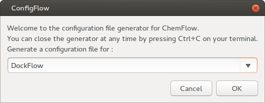
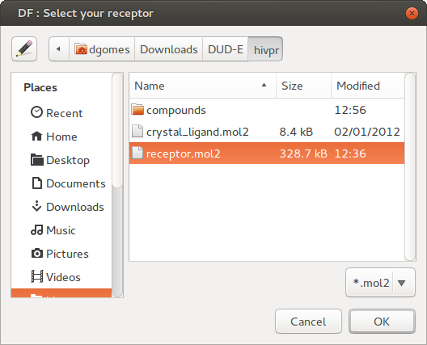
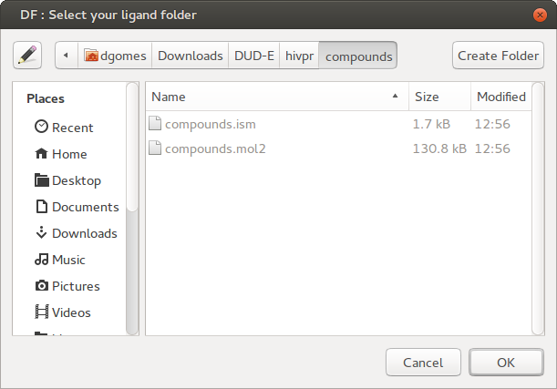
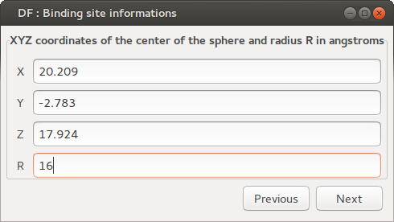
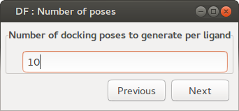
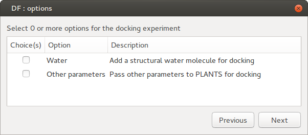
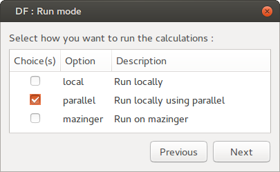
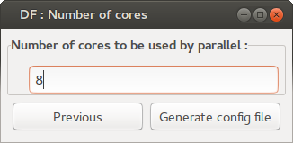
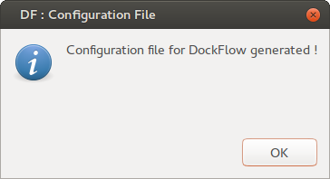

# DockFlow tutorial on virtual screening.
Virtual screening (VS) has become an integral part of the drug discovery process. VS is a computational technique to probe chemical libraries for candidate binders to a target molecule of known structure, typically a protein receptor or enzyme.

Top ranking compounds are prioritized to a manageable number that can be synthesized, purchased, and tested. Practical VS scenarios are focused on the design and optimization combinatorial libraries and to enrich locally avaible libraries or vendor offerings.

Several compound libraries are available for **VS** such as the [NCBI PubChem ](http://pubchem.ncbi.nlm.nih.gov), [eMolecules](www.emolecules.com) and [ZINC](zinc.docking.org), include commercially available compounds. There are also specialized libraries with expected biological features such as the hit or lead-like compounds, nutraceuticals [CITE], natural products [CITE], and metabolome [CITE].  The [FDA-approved drugs](www.epa.gov/ncct/dsstox) library, can also be used to repurpose compounds with acceptable safety/toxicity profiles.

## Summary
Here you will run a virtual screening campaign with the HIV-1 protease (HIVPR) as target. For quality controle and proper assessment of the results, you will be using input files from the [DUD-E](dude.docking.org "DUD-E: A Database of Useful (Docking) Decoys — Enhanced"). The HIVPR subset contains a properly prepared enzyme structure (**receptor**) and sets of active and inactive compounds (**ligands**) in the isomeric SMILES format. A reference ligand crystal structure, and structural files for all compounds are also provided.

First you will prepare the **receptor** and **ligands** to the .mol2 format, as required by DockFlow, then configure...

## Goals
* Prepare structures from a chemical library
* Run the virtual screening compounds
* Prioritize compounds by rescoring biding poses

# Getting Started
## Download and extract the test set.
Use the following commands 
```bash
# Create an empty folder
mkdir dockflow_VS_tutorial
cd dockflow_VS_tutorial

# Download the DUD-E's HIVPR subset
wget http://dude.docking.org/targets/hivpr/hivpr.tar.gz
tar xvfz  hivpr.tar.gz
```
Use your favorite molecule visualizer to get a glimpse into the protein structure and its interactions with the known ligand. Notice that the protein already contains only polar hydrogens while the ligand has all hydrogens. Docking programs have different ways to handle Hydrogen atoms, generally only polar hydrogens are considered while non-polar are merged into united atom after partial charge assignment. 
```bash
pymol receptor.pdb crystal_ligand.mol2
```
## Select the docking center and boundaries for the search.
Docking programs need a center and area to search for the binding poses, you must carefully select it. Since we have a reference ligand, we'll just use it's geometrical center, as for the boundaries well use the size of this ligand and give it some extra space. 

Some docking software use a sphere to define the search space, while others ask for individual dimensions on the Cartesian space. Here's a quick way to obtain the values you need using VMD.
```bash
vmd -dispdev text crystal_ligand.mol2 <<EOF
measure center [atomselect top all] 
measure minmax [atomselect top all] 
quit
EOF
```
center: 
20.20944595336914 -2.783501148223877 17.924930572509766

Minimum and maximum coordinates.
{13.60420036315918 -6.734600067138672 12.50979995727539} {27.495800018310547 0.5174000263214111 25.323999404907227}

### Center
You don't have to be super precise on these coordinates, for this case, they are:
x = 20.209, y = -2.783, z = 17.924
### Boundaries
The values are aproximately: 
**x**=13.891, **y**=7.252, **z**=12.82
so lets give'em some suggar and set to
**x**=16.0, **y**=9.5, **z**=15.0
Make sure the the sphere is set to the larger dimension !
**sphere**=16.0


## Is ChemFlow configured ?
It is fundamental to have ChemFlow properly configured before continuing.
```bash
export CHEMFLOW_HOME=/home/dgomes/github/ChemFlow/
$CHEMFLOW_HOME/install.sh

# Source it to get the program Paths.
source /home/dgomes/github/ChemFlow//ChemFlow.config
```
Bellow are the contents a sample $CHEMFLOW_HOME/ChemFlow.config. 
```bash
# This file contains the path to all programs used by ChemFlow, as well as some default parameters.

# Path to PLANTS executable (not required for mazinger)
plants_exec="/home/dgomes/software/plants//PLANTS1.2_64bit"

# Path to SPORES executable, only needed for the PDB mode in ScoreFlow
spores_exec="/home/dgomes/software/plants//SPORES_64bit"

# Path to AutoDock Vina executable (not required for mazinger)
vina_exec="/home/dgomes/software/autodock_vina_1_1_2_linux_x86/bin//vina"

# Path to Utilities24 folder of AutoDockTools (in MGLTools)
adt_u24="/home/dgomes/MGLTools-1.5.6/MGLToolsPckgs/AutoDockTools/Utilities24/"

# Path to GNU Parallel executable, needed to run procedures in parallel locally.
parallel="/usr/bin/parallel"

# Path to amber.sh
amber="/home/dgomes/software/amber16/bin/amber.sh"

# Run Amber MD with sander (free) or pmemd (paid)
amber_md="sander"

# Path to Gaussian executable
gaussian_exec=""
```

## Prepare the receptor
Docking will be performed with PLANTS which requires all Hydrogen atoms to be added, proper atoms types and partial charges assigned. Notice that each docking program has its own scheme of atom typing and charge assignment, so this .mol2 file should not be used for other docking programs. You will have to do this in two steps, because the "receptor.pdb" misses the "Occupancy values"... thanks DUD-E !
```bash
babel -ipdb receptor.pdb -opdb tmp.pdb
$spores_exec --mode complete tmp.pdb receptor.mol2
```
## Prepare the ligand library
The DUD-E library came in isomeric smiles which is great. However the proper generation of an initial conformer, near the bioactive conformation has major impacts on the docking (CITE). Another major issue is the proper tautomer selection. For the sake of simplicity none of this subjects will be covered here.

To run this tutorial in a reasonable time, we choose to use only a subset of 10 actives and 10 inactives and merge into a single SMILES file, then generate the 3D conformations and assign Gasteiger charges, saving all in the **compounds** folder.
```bash
mkdir compounds
cd compounds
head -10 ../actives_final.ism  > compounds.ism
head -10 ../decoys_final.ism  >> compounds.ism
babel -ismi compounds.ism -omol2 compounds.mol2 --gen3D
cd ../
```
Done we're ready for docking!

## Configuring DockFlow
Your docking can be easily configured with our tool **ConfigFlow**, just follow the instructions.  
* Select either **DockFlow** or **ScoreFlow**  

* Select the .mol2 prepared for the **receptor**.  

* Select the folder containing the **compounds** to dock.  

* Fill up with the **center** and **boundaries**.  

* Choose the number of docking poses, these may affect your success rate.   

* In case you have extra parameters, feel free to include them.  

* Choose how you will run the calculation, local, parallel or on a PBS cluster. (SLURM is comming to config)  

* If parallel, choose how many compute cores do want to use each time.  

* You are done !  



